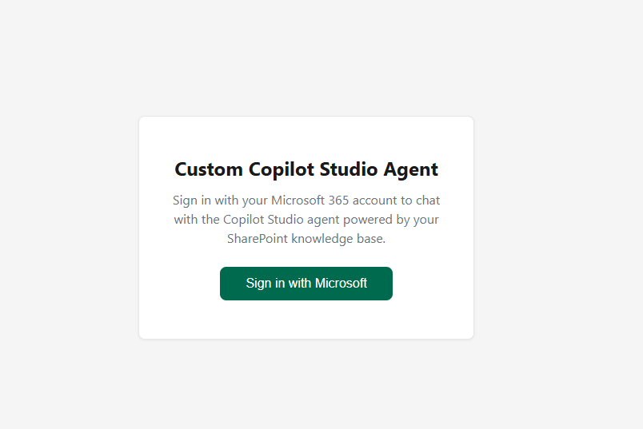
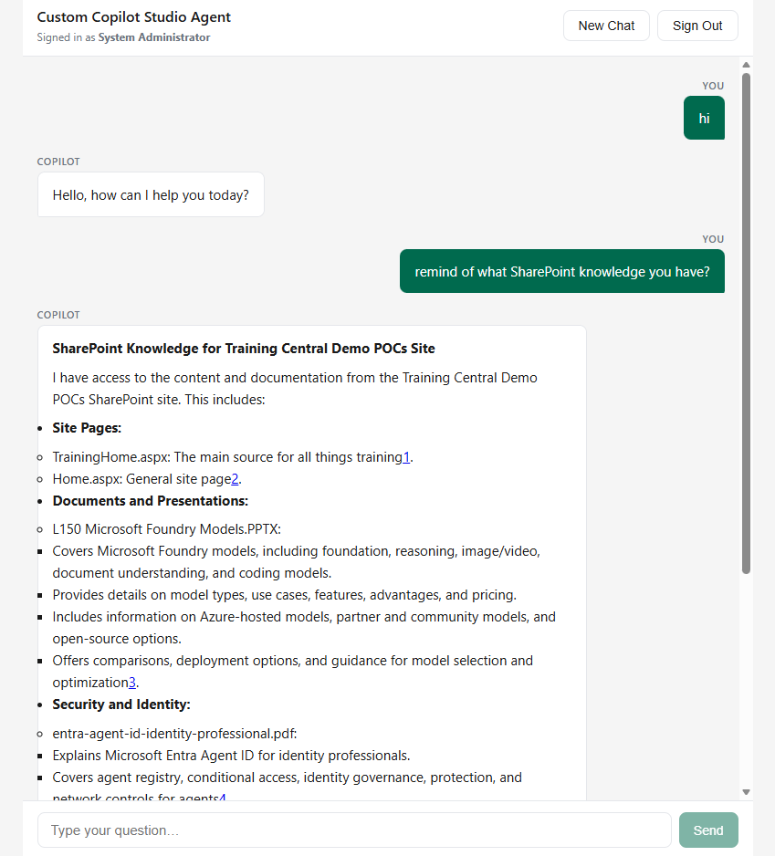
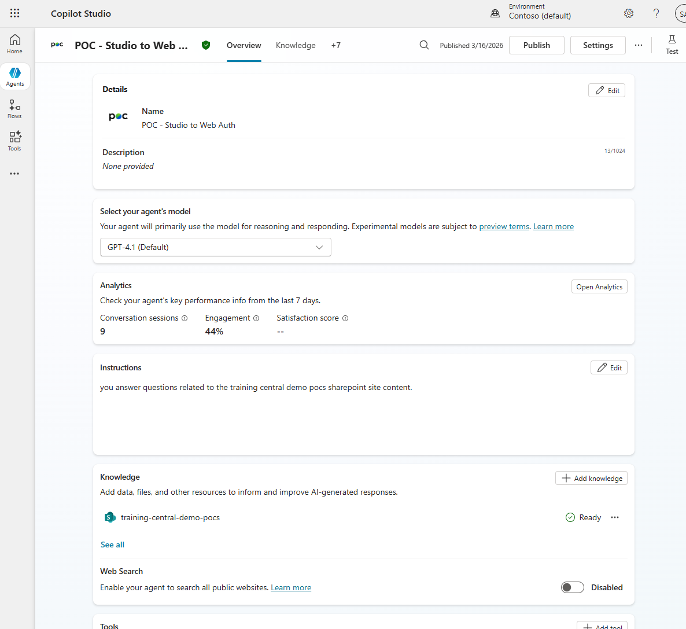
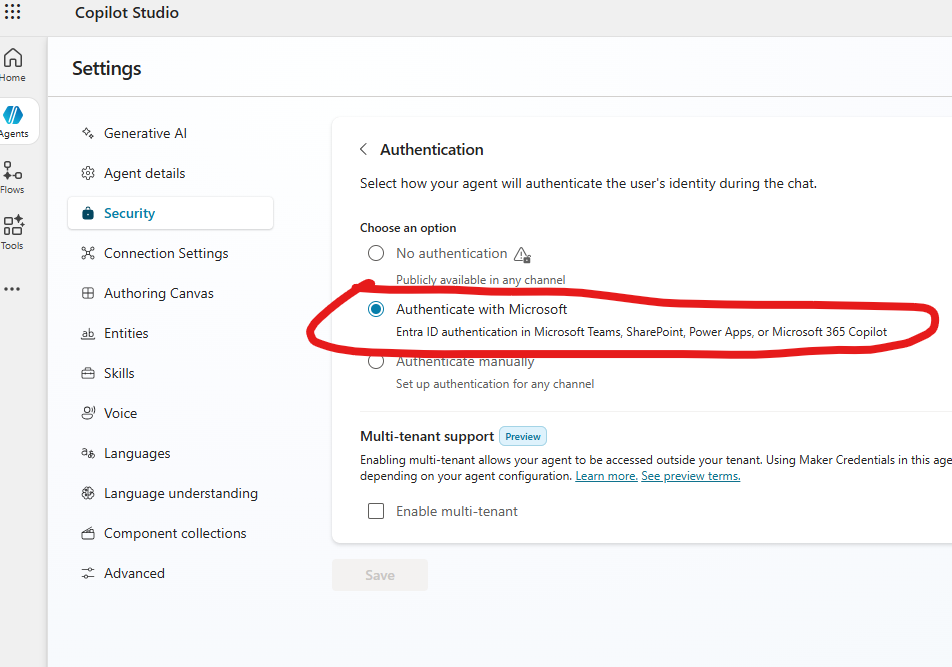

# Copilot Studio Web App

An external web application (outside the M365 ecosystem) that lets users sign in
with their **Microsoft 365 credentials** and chat with a **Copilot Studio agent**
grounded with SharePoint knowledge.

## Screenshots





## Architecture

```
┌────────────────────────┐     ┌─────────────────────────┐     ┌──────────────────┐
│  Next.js Frontend      │────▶│  Python Backend          │────▶│  Copilot Studio   │
│  (React · Port 3000)   │◀────│  (aiohttp · MSAL        │◀────│  Agent (SharePoint)│
│                        │     │   · Agents SDK · 3978)   │     │                  │
└────────────────────────┘     └─────────────────────────┘     └──────────────────┘
```

**Auth flow (OAuth2 Authorization Code — Confidential Client):**

1. Frontend calls `GET /api/auth/login` → backend returns the Entra ID authorize URL.
2. User authenticates at Entra ID → redirected back to the frontend with `?code=...`.
3. Frontend sends the code to `POST /api/auth/callback`.
4. Backend exchanges the code for tokens using MSAL `ConfidentialClientApplication` and caches them.
5. Backend returns a `sessionId` to the frontend.
6. Frontend sends chat messages with the `sessionId`.
7. Backend uses the cached delegated token to call Copilot Studio via the connection string.

---

## Prerequisites

| # | Requirement |
|---|-------------|
| 1 | Python 3.9+ |
| 2 | Node.js 18+ |
| 3 | An Agent created in [Copilot Studio](https://copilotstudio.microsoft.com/) and **published**, with a SharePoint knowledge source |
| 4 | An **Entra ID App Registration** — **Web** platform (confidential client with a secret) |
| 5 | Admin consent for the **Power Platform API** (`CopilotStudio.Copilots.Invoke`) permission |

---

## Step 1 — Create the Copilot Studio Agent

1. Go to [Copilot Studio](https://copilotstudio.microsoft.com/).
2. Create a new Agent and add a **SharePoint** knowledge source.

3. **Publish** the agent.
4. Go to **Settings → Security → Authentication** and select **"Authenticate with Microsoft"**.
   > **Important:** Do *not* choose "Authenticate manually" — that triggers an in-chat
   > OAuth card flow that conflicts with the API-level bearer token used by this app.
   
5. Get the connection string:
   - Go to **Settings → Advanced → Metadata** (or **Channels → Web app → Microsoft 365 Agents SDK**).
   - Copy the full connection string URL. It looks like:
     ```
     https://default6eef...bfe2.82.environment.api.powerplatform.com
       /copilotstudio/dataverse-backed/authenticated/bots/cra99_agent1
       /conversations?api-version=2022-03-01-preview
     ```
   - This is your `COPILOT_CONNECTION_STRING`.

---

## Step 2 — Create an Entra ID App Registration

1. Go to [Azure Portal → Entra ID → App registrations](https://portal.azure.com/#view/Microsoft_AAD_RegisteredApps/ApplicationsListBlade).
2. Click **New registration**.
   - **Name**: `Custom Copilot POC`
   - **Supported account types**: *Accounts in this organizational directory only* (Single tenant)
   - **Redirect URI**: Platform = **Web**, URI = `http://localhost:3000`
3. After registration, note:
   - **Application (client) ID** → `CLIENT_ID`
   - **Directory (tenant) ID** → `TENANT_ID`
4. Go to **Certificates & secrets → New client secret**:
   - Create a secret and copy the **Value** → `CLIENT_SECRET`
5. Go to **API Permissions → Add a permission**:
   - Tab: **APIs my organization uses**
   - Search for **Power Platform API**
   - Select **Delegated permissions → CopilotStudio → CopilotStudio.Copilots.Invoke**
   - Click **Add permissions**
6. Click **Grant admin consent** for your tenant.

> **Tip**: If *Power Platform API* doesn't appear, follow [these instructions](https://learn.microsoft.com/power-platform/admin/programmability-authentication-v2#step-2-configure-api-permissions) to register it in your tenant first.

---

## Step 3 — Configure Environment Variables

### Python backend (`.env`)

Copy `.env.template` → `.env` and fill in your values:

```env
# ── Server ──
PORT=3978
ALLOWED_ORIGIN=http://localhost:3000

# ── Entra ID App Registration ──
TENANT_ID=<Directory (tenant) ID>
CLIENT_ID=<Application (client) ID>
CLIENT_SECRET=<Client secret value>
REDIRECT_URI=http://localhost:3000

# ── Copilot Studio Connection String ──
COPILOT_CONNECTION_STRING=<Full connection string URL from Step 1>
```

### Next.js frontend (`frontend/.env.local`)

Create `frontend/.env.local`:

```env
NEXT_PUBLIC_API_URL=http://localhost:3978
```

The frontend only needs the backend URL. All authentication is handled server-side.

---

## Step 4 — Run Locally

### Terminal 1 — Python backend

```bash
python -m venv .venv            # one-time setup
.venv\Scripts\activate          # Windows  (source .venv/bin/activate on Mac/Linux)
pip install -r requirements.txt
python app.py
```

You should see:

```
INFO:__main__:Copilot Studio agent: env=default6eef...  schema=cra99_agent1
INFO:__main__:Starting Copilot Studio proxy on http://0.0.0.0:3978
======== Running on http://0.0.0.0:3978 ========
```

### Terminal 2 — Next.js frontend

```bash
cd frontend
npm install
npm run dev
```

Open **http://localhost:3000** and click **Sign in with Microsoft**.

---

## Step 5 — Deploy to Azure

See **[DEPLOY.md](DEPLOY.md)** for a full step-by-step guide to deploy on Azure Container Apps using `azd up`.

**Quick version:**

```bash
azd init
# set secrets via azd env set ...
azd auth login
azd up
```

---

## API Endpoints

| Method | Path | Description |
|--------|------|-------------|
| `GET` | `/api/auth/login` | Returns the Entra ID authorization URL |
| `POST` | `/api/auth/callback` | Exchanges an authorization code for tokens; returns `{ sessionId, displayName, email }` |
| `GET` | `/api/auth/me?sessionId=...` | Returns user info for an existing session |
| `POST` | `/api/auth/logout` | Clears the server-side session |
| `POST` | `/api/chat` | Sends `{ message, sessionId }` to the Copilot Studio agent; returns `{ responses, suggestedActions, sessionId, conversationId }` |
| `POST` | `/api/reset` | Clears the conversation so the next message starts fresh |
| `GET` | `/api/health` | Liveness check |

---

## How It Works

| Component | Role |
|-----------|------|
| `app.py` | aiohttp web server. Handles the OAuth2 auth-code flow via MSAL `ConfidentialClientApplication`, caches user tokens by session, and proxies chat messages to the Copilot Studio agent using the `microsoft-agents` SDK `CopilotClient`. |
| `frontend/` | Next.js app that provides the login UI and chat interface. Redirects to Entra ID for sign-in, sends the authorization code to the backend, and uses the returned `sessionId` for subsequent chat requests. |
| `start_server.py` | (Optional) Alternative server starter using the full Agents SDK hosting stack with JWT middleware — useful if you later want to integrate with Azure Bot Service. |

---

## Project Structure

```
copilot-studio-webapp/
├── app.py                    ← Python backend (auth + chat proxy)
├── start_server.py           ← Alternative Agents SDK server (optional)
├── requirements.txt          ← Python dependencies
├── .env.template             ← Backend env vars template
├── Dockerfile                ← Multi-stage build (frontend + backend)
├── azure.yaml                ← azd deployment config
├── DEPLOY.md                 ← Azure Container Apps deploy guide
├── DEPLOYMENT-OPTIONS.md     ← Hosting decision tree
├── infra/                    ← Bicep IaC templates
├── assets/                   ← Screenshots
└── frontend/                 ← Next.js frontend
    ├── .env.local.template   ← Frontend env vars template
    ├── app/
    │   ├── layout.tsx        ← Root layout
    │   ├── page.tsx          ← Login screen + auth code exchange
    │   └── globals.css       ← Styling
    ├── components/
    │   └── chat.tsx          ← Chat UI component
    ├── lib/
    │   └── copilot-api.ts    ← API client for the Python backend
    ├── package.json
    ├── tsconfig.json
    └── next.config.ts
```

---

## Troubleshooting

| Symptom | Cause | Fix |
|---------|-------|-----|
| Bot replies "I'll need you to sign in" | Copilot Studio authentication is set to "Authenticate manually" | Change to **"Authenticate with Microsoft"** in Copilot Studio → Settings → Authentication |
| `ValueError: Chunk too big` | Copilot Studio responses exceed aiohttp's default 64 KB line buffer | Already handled — `app.py` passes `read_bufsize=1MB` to the SDK's `ClientSession` |
| `AADSTS7000218: request body must contain … client_secret` | App registration is configured as a **public client (SPA)** | Change the redirect URI platform to **Web** in Entra ID → App registrations → Authentication |

---

## References

- [Microsoft 365 Agents SDK — Python Samples](https://github.com/microsoft/Agents/tree/main/samples/python)
- [CopilotStudio Client Sample](https://github.com/microsoft/Agents/tree/main/samples/python/copilotstudio-client)
- [Integrate Copilot Studio with M365 Agents SDK](https://learn.microsoft.com/en-us/microsoft-copilot-studio/publication-integrate-web-or-native-app-m365-agents-sdk)
- [Power Platform API Permissions Setup](https://learn.microsoft.com/power-platform/admin/programmability-authentication-v2#step-2-configure-api-permissions)
